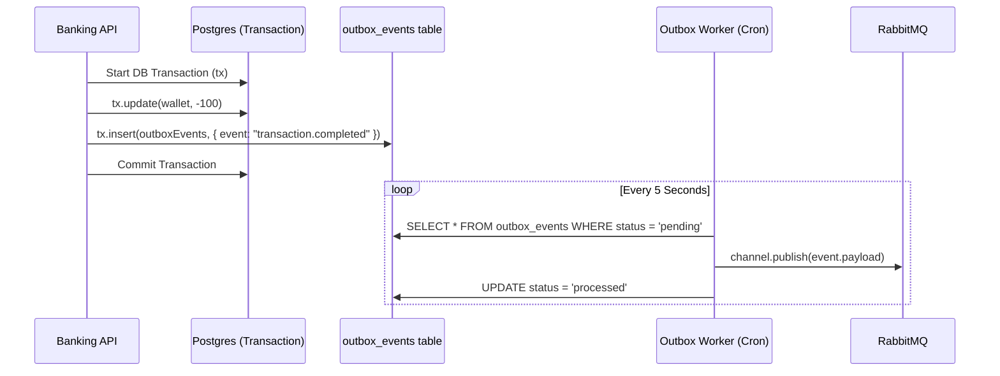

# Senior Architecture: Full Wallet Simulation

This document outlines the advanced distributed systems architecture and database design patterns implemented in this microservice environment.

## 🏗 System Overview

The system is split into two primarily distinct domains, orchestrated by an Nginx API Gateway and communicating asynchronously via RabbitMQ:

1. **User Service**: Handles authentication, user management, and JWT provisioning.
2. **Core Banking Service**: Handles the ledger, wallets, transactional concurrency, and double-entry bookkeeping.

```mermaid
graph TD
    Client(Client App/Postman) -->|HTTP| Nginx(API Gateway)
    
    Nginx -->|/api/users/*| UserService(User Service)
    Nginx -->|/api/banking/*| BankingService(Core Banking)
    
    UserService -->|DB Conn| UserDB[(User PostgreSQL)]
    BankingService -->|DB Conn| BankingDB[(Banking PostgreSQL)]
    
    UserService -->|Publishes: user.created| RabbitMQ((RabbitMQ))
    RabbitMQ -->|Consumes: user.created| BankingService
    
    BankingService -->|Publishes: transaction.failed/completed| Outbox Worker
    Outbox Worker -->|Polls Outbox Table| BankingDB
    Outbox Worker -->|Publishes| RabbitMQ
    
```

---

## 🚀 Advanced Implementation Patterns

### 1. Database isolation per microservice
Each service has its own dedicated PostgreSQL instance. This enforces loose coupling:
- **Rule**: `user-service` cannot directly query `core_banking_service_db`, and vice versa.
- **Benefit**: If a service goes down, there is no cascading failure in the database layer. You can scale the banking database without touching the user database.

### 2. Double-Entry Bookkeeping (Immutable Audit Trails)
Banking systems cannot simply do `balance = balance + 100`. Money must technically move strictly.
- **`transactions` table**: Represents the current status of a user's transfer, funding, or withdrawal attempt. Can be updated (e.g. `pending` -> `completed` -> `failed`).
- **`ledger_entries` table**: Immutable (append-only) tracking of debits and credits. When Alice sends Bob $5, Alice's wallet gets a Debit Ledger Entry and Bob's wallet gets a Credit Ledger Entry for the exact same transaction ID.

### 3. Concurrency Control (Pessimistic Row Locking)
**The Problem**: If a user submits two withdrawal requests at the exact same millisecond, and both read `balance = $200` concurrently, both requests might approve a $150 withdrawal, causing the balance to illegally fall below $0. 

**The Solution**: We utilize Postgres' `FOR UPDATE` cursor locking.
```typescript
// Inside wallet.data-access-layer.ts
await db.select().from(wallets).where(...).for("update")
```
This forces concurrent database requests mutating the same wallet to queue cleanly, avoiding the "Read-Modify-Write" race condition.

### 4. Idempotency Keys (API Integrity)
Distributed clients experience network instability. A client might submit a "Fund Wallet" request, but their internet flakes, causing them to click "Fund" again.
By accepting an `idempotencyKey` UUID from the client header/body, the Core Banking API registers this key to a specific Database transaction. If the key is seen again, the request is instantly rejected or returns the original cached successful response.

### 5. Transactional Outbox Pattern (100% Reliable Messaging)
**The Problem**: "Dual Write" syndrome. When a user transfers money, we do two things: update Postgres, and publish a `transaction.completed` event to RabbitMQ. If Postgres commits successfully, but the RabbitMQ server crashes exactly 1ms later, the downstream services (like notifications) never learn about the transaction. The data is fundamentally out of sync.

**The Solution**: 

By saving the event into the database **within the exact same transaction block** as the balance update, we guarantee the event exists. A decoupled background loop `outbox.worker.ts` polls this table safely and reliably ships the data to RabbitMQ.

### 6. Dead Letter Exchanges (DLX)
If an event makes it to RabbitMQ, but the subsequent consumer (e.g., event handler in the Banking microservice) crashes consecutively because the payload is malformed (Poisoned Message), the consumer would endlessly loop trying to read it.
We route failed messages (using `deadLetterExchange`) into a secondary `dlx-queue`. Operations engineers can inspect `dlx-queue` natively to determine what events failed completely without blocking normal live traffic.

---

### Conclusion
By implementing these architectural principles, this repository realistically simulates the operational rigor of a modern FinTech organization.
