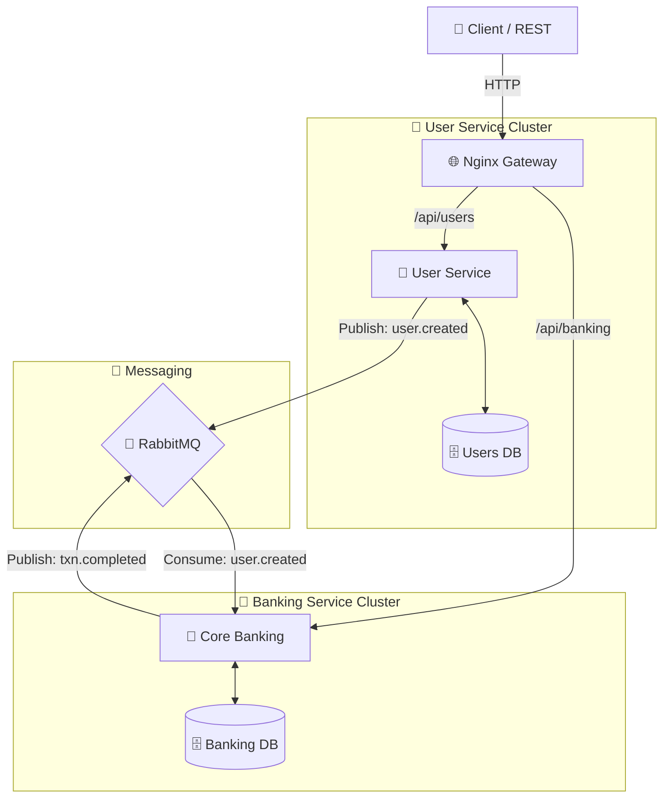

<br/>
<div align="center">
  

  # 💳 Full-Scale Wallet Microservices Simulation
  ### A feature-rich, event-driven financial ecosystem built for resilience and scale.

  [](https://nodejs.org/)
  [](https://www.typescriptlang.org/)
  [](https://www.postgresql.org/)
  [](https://www.rabbitmq.com/)
  [](https://www.docker.com/)

</div>

---

## 📖 Table of Contents
- [✨ Core Concept](#-core-concept)
- [🏗 System Architecture](#-system-architecture)
- [🏦 Banking Features](#-banking-features)
- [📦 Project Structure](#-project-structure)
- [🚀 Quick Start Guide](#-quick-start-guide)
- [🛠 Service Technicals](#-service-technicals)
- [🤝 Contributing Guidelines](#-contributing-guidelines)

---

## ✨ Core Concept
This project is a high-fidelity simulation of a digital wallet platform (modeled after industry leaders like Paystack or Chipper Cash). It leverages **Microservices Architecture** to separate concerns between user identity and financial logic, using **RabbitMQ** for reliable, asynchronous event-driven communication.

---

## 🏗 System Architecture

### 📊 Service Interaction Diagram (Mermaid)


### 🧠 Data Flow Illustration
1. **User Identity**: Managed by `User Service`. On registration, a "User Created" event is broadcast.
2. **Auto-Wallet**: `Core Banking` listens for new users and instantly initializes a personal wallet.
3. **Transaction Engine**: Handles Deposits, Withdrawals, and P2P Transfers with **Atomic Balance Updates**.
4. **Ledger Integrity**: Every transaction creates an immutable entry in the Ledger table for audit trails.
5. **Idempotency**: Prevents double-spend or duplicate processing via cryptographic keys.
6. **Concurrency Control**: Pessimistic database row locking (`SELECT FOR UPDATE`) prevents read-modify-write race conditions.
7. **Transactional Outbox**: Guarantees 100% reliable event delivery to RabbitMQ by storing events in the database transactionally.

---

## 🏦 Banking Features

| Feature | Description | Implementation Detail |
|---------|-------------|-----------------------|
| 👤 **Auth Service** | Secure JWT-based Login/Reg | Bcrypt hashing, Refresh Token rotation |
| 💰 **Wallet Mgmt** | Zero-config wallet creation | Auto-provisioning via RabbitMQ hooks |
| 📥 **Funding** | Instant wallet deposits | Idempotency protected, ledger recorded |
| 📤 **Withdrawals** | Secure fund withdrawals | Real-time balance guard checks |
| 🔄 **P2P Transfer**| User-to-User fund moves | Atomic dual-account ledger updating |
| 📜 **History** | Deep transaction audit | Paginated history with reference tracking |
| 🛡 **Reliability**| Dead Letter Exchanges & Outbox | Failed messages are queued cleanly, and DB events never desync |

---

## 📦 Project Structure

```text
📂 apps
 ├── 🌐 nginx             # API Gateway & Reverse Proxy
 ├── 👤 user-service      # Identity, Passwords, JWT, Auth
 ├── 🏦 core-banking      # Wallets, Ballets, Ledger, Txns
 └── 📬 notification-service # (Planned) Async alerts
```

---

## 🚀 Quick Start Guide

### 1️⃣ Requirements
- **Docker Desktop** (Required for Orchestration)
- **Node.js 18+** (For local development)

### 2️⃣ The One-Command Launch
Run this in the root directory to spin up all microservices, databases, and message brokers:
```bash
docker-compose up --build
```

### 3️⃣ Verify the Pulse
Check if the system is alive:
- **Gateway Health**: `GET http://localhost/health`
- **RabbitMQ Dashboard**: `http://localhost:15672` (Login: `guest/guest`)

### 4️⃣ First Run Steps
1. **Register User**: POST to `/api/users/auth/register`.
2. **Check Wallet**: The banking service will auto-create a wallet for you (using RabbitMQ events).
3. **Fund Wallet**: POST to `/api/banking/banking/deposit`.
4. **Test Outbox worker**: View your container logs to see the background worker flawlessly processing banking events!

---

## 🛠 Service Technicals

### 🔐 User Service (Port 3000)
- **Tech**: Express, Drizzle ORM, Postgres, JWT.
- **Role**: Source of truth for who a user is.

### 🏦 Core Banking (Port 3001)
- **Tech**: TypeScript, RabbitMQ, Drizzle ORM.
- **Rule**: Follows strict **Double-Entry Bookkeeping**. A debit in one wallet *must* match a credit entry in the ledger.

---

## 🤝 Contributing Guidelines

We love contributors! To keep our codebase premium:

1. **Service Separation**: Never let banking service access the users database directly. Use RabbitMQ.
2. **Transaction Safety**: All financial mutations must be wrapped in atomic db transactions (`db.transaction`).
3. **Outbox Pattern**: Never use `publishEvent` raw inside a database transaction block. Insert it into `outboxEvents` instead to guarantee state.
3. **Pino Logging**: Use the structured pino child loggers for every module (no `console.log`).
4. **Type Safety**: New services must return the standard `ServiceResult<T>` union type.

### 🐛 How to submit
1. Fork the repo.
2. Create your feature branch (`git checkout -b feat/cool-feature`).
3. Commit with a clear summary.
4. Open a Pull Request!

---
<div align="center">
  <b>Designed & Built with Precision by Marvellous Obatale</b>
</div>
